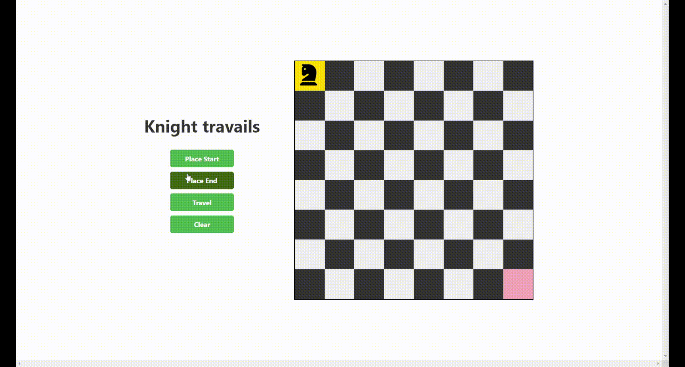

# Knights Travails Project

👉<a href="https://husseinn-essam.github.io/Knights-Travails/">Live Demo</a>

Solves the knight's shortest path problem on a chessboard! 🐴

This project implements **Breadth first search algorithm** to find the shortest path for a knight to travel between two positions on a chessboard. It demonstrates the knight's movements following the rules of chess.

## Demo

## Features

- Interactive chessboard UI
- Click to place start and end positions
- Visualize the shortest path traveled by the knight
- Responsive design for desktop and mobile devices

## Technologies Used

- HTML
- CSS
- JavaScript

## Usage

1. Click the "Place Start" button to select the starting position on the chessboard.
2. Click the "Place End" button to select the destination position on the chessboard.
3. Click the "Travel" button to calculate and animate the knight's shortest path.
4. Use the "Clear" button to reset the chessboard and start over.
